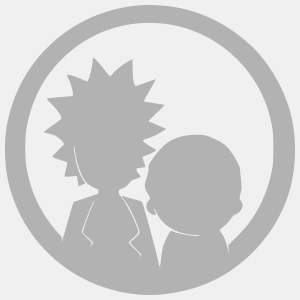
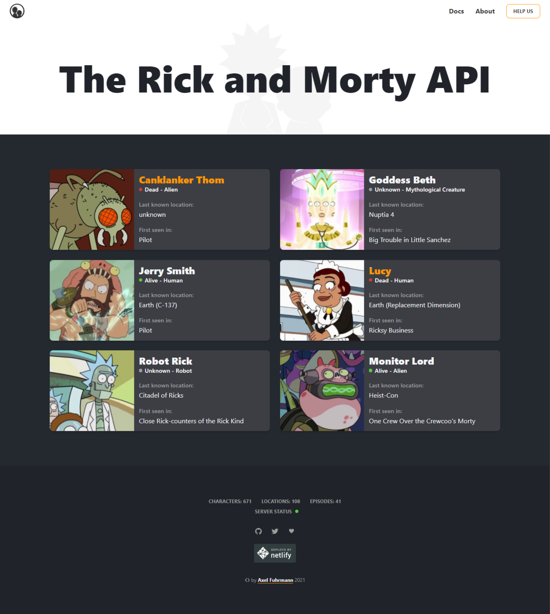

<h1 align=center>


---

🚀 Projeto Rick And Morty ✔️ <br>


</h1>

## 📑️ Índice

- [O projeto](#📝️-Sobre)
- [Apresentação Gif](#🚀️-Apresentação-do-site)
- [Como usar](#💾️-Como-baixar/testar-o-projeto)
- [Contato](#-Desenvolvido-com-💙️-por)
- [Licença](#-Licença)

---

## 📝️ Sobre

---

<h4>
O projeto trata-se de um desafio encontrado no Github através do link:
 <a href="https://github.com/indigotech/taq-challenge" target="_blank">https://github.com/indigotech/taq-challenge</a>, onde é necessário criar uma aplicação React, (Detalhes dos desafios disponível no link mencionado acima).
 Para criação da aplicação foi proposto a utilização da API disponível através do link:
 <a href="https://rickandmortyapi.com/" target="_blank">https://rickandmortyapi.com/</a> Por questões do desafio proposto foi utilizada a API versão Graphql.
</h4>

---

## 🚀️ Apresentação do site

---

<h2>Como não havia um layout proposto, resolvi seguir o layout do site da própria API, ou seja, o meu desafio pessoal foi clonar o site da própria API, rs:</h2>

---

<h2>Layout site da API:<h2>

---

<h3>

</h3>

---

<h2>Visualização - Desktop:<h2>

---

<h3>

</h3>

---

<h2>Visualização - Responsivo:<h2>

---

<h3>

</h3>

---

### 🚀️ Tecnologias utilizadas

---

- ReactJS
- Graphql
- Axios
- Styled-Components
- API: <a href="https://rickandmortyapi.com/" target="_blank">https://rickandmortyapi.com/</a>

---

### 💾️ Como baixar/testar o projeto

- Você irá precisar instalar o [Git](https://git-scm.com/), [NodeJS](https://nodejs.org/pt-br/download/) + [Yarn](https://classic.yarnpkg.com/en/docs/install/) + [Visual Studio code](https://code.visualstudio.com/) ou seu editor de código preferido.

---

```bash
# Versões mínimas ou superiores.
$ node -v
v12.19.0

$ npm -v 
6.14.8

OU

$ yarn -v 
1.22.5

```

- Para configurar e rodar o projeto siga o passo a passo:

```bash
#Clonar o repositório na sua pasta de preferência, abrindo seu terminal de preferência e rodando o comando:
$ git clone https://github.com/RicardoMejolaro/Projeto-Rick-And-Morty.git

#Acessar e abrir a pasta que foi efetuada o clone:
#Na pasta abrir projeto no VsCode ou no seu editor preferido:
$ No seu editor, procurar a pasta com que foi inclusa com o clone, selecionar e abrir.

#Abrir seu terminal de comando preferido via editor de código ou fora do editor, após acessar a pasta (no passo acima), acessar a pasta do projeto onde abrirá a branch master do repositório, com o comando:  
$ cd rickandmorty

#Com o terminal aberto rodar o comando
$ npm install ou yarn install (para instalar as dependências necessárias)

#Agora só rodar o projeto com o comando
$ npm start ou yarn start

#Pronto projeto abrirá em seu navegador padrão
Agora é só testar em seu navegador!

```
---

### Desenvolvido com 💙️ por

***Ricardo Mejolaro*** 
<br/> 
<a href="https://www.linkedin.com/in/ricardo-mejolaro/">

</a>

### Licença

Este projeto está licenciado sob a licença MIT - consulte a página [LICENSE](https://opensource.org/licenses/MIT) para obter detalhes.
